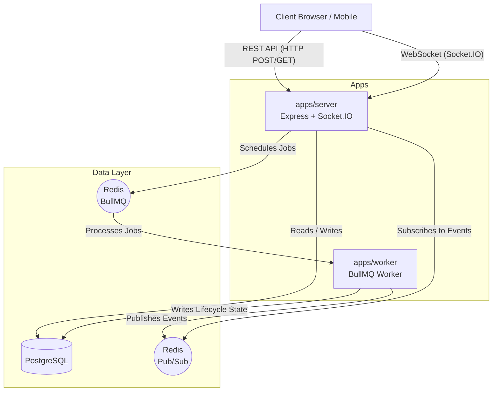
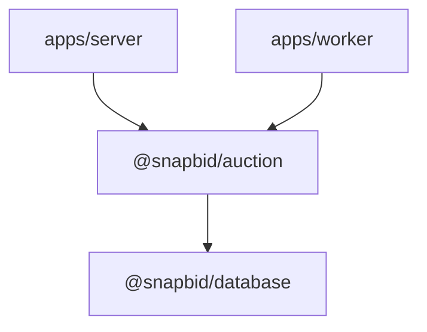

# System Architecture

## Overview

SnapBid is composed of multiple applications and shared packages managed within a Turborepo monorepo. The backend is designed for high concurrency and real-time event broadcasting, explicitly separating HTTP request handling from background job processing.

## Major Components

### Applications (`apps/`)

1. **Server (`apps/server`)**:
   - The primary Express HTTP server exposing the REST API.
   - The Socket.IO server handling client connections and room management.
   - Subscribes to Redis Pub/Sub to forward internal events to connected WebSocket clients.
2. **Worker (`apps/worker`)**:
   - A standalone Node.js process running BullMQ workers.
   - Processes scheduled auction lifecycle jobs (`START_AUCTION`, `END_AUCTION`).
   - Publishes state changes via Redis Pub/Sub (rather than importing Socket.IO directly).
3. **Web (`apps/web`)**:
   - _Status: Not Yet Implemented._

### Packages (`packages/`)

1. **Database (`@snapbid/database`)**:
   - Contains the Prisma schema (`schema.prisma`), migrations, and exports the configured Prisma Client.
   - Acts as the foundational data layer.
2. **Auction (`@snapbid/auction`)**:
   - Contains core domain logic for the auction lifecycle.
   - Used by both the `server` (to handle immediate commands) and the `worker` (to process scheduled state transitions).
3. **Shared (`@snapbid/shared`)**:
   - Zod schemas (Auth, Bid, Auction) utilized across applications to ensure strict contract validation.

## High-Level Architecture Diagram

## Dependency Direction

To maintain clean architecture, dependencies flow strictly downwards from applications to packages. Shared packages **must not** depend on application-level code.

- **@snapbid/database** has zero internal dependencies. It provides data access.
- **@snapbid/auction** depends on `@snapbid/database` to execute lifecycle logic, but knows nothing about Express or BullMQ.
- **apps/server** and **apps/worker** depend on the packages to orchestrate infrastructure concerns (HTTP, WebSockets, Job Queues).

## Communication Between Processes

Because the Server and Worker run in separate processes, they do not share memory or a single Socket.IO instance.

When the Worker transitions an auction to `LIVE`, it cannot emit a Socket.IO event directly. Instead, the Worker relies on **Redis Pub/Sub** to publish an internal event (`auction:started`). The Server subscribes to this Redis channel, receives the event, and broadcasts it to the appropriate Socket.IO room.
