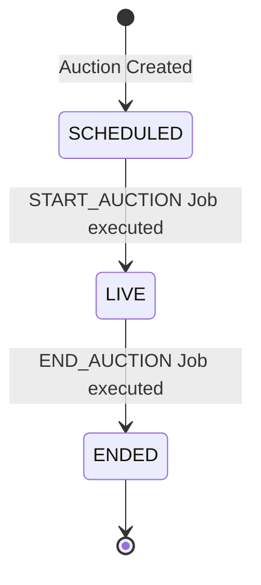

# Auction Lifecycle

## State Machine

The core of SnapBid is the auction state machine. Auctions transition through specific statuses during their lifecycle.

### Valid States

- **DRAFT**: Initial creation state.
- **SCHEDULED**: The auction is configured and waiting for its `startTime`.
- **LIVE**: The auction is currently accepting bids.
- **ENDED**: The auction has reached its `endTime` and is closed to new bids.
- **CANCELLED**: The auction was terminated early.

## Lifecycle Execution

State transitions are not triggered by active HTTP requests. Instead, they are executed by delayed jobs managed by **BullMQ** running in the `apps/worker` process.

### 1. Auction Creation

When an auction is created via the Server API, two delayed jobs are placed into the BullMQ `auction` queue:

1. `START_AUCTION`: Delayed to execute exactly at `startTime`.
2. `END_AUCTION`: Delayed to execute exactly at `endTime`.

### 2. START_AUCTION Job

When the worker picks up the `START_AUCTION` job, it calls `startAuctionService` in `@snapbid/auction`:

- **Validation**: Ensures the auction is currently `SCHEDULED` and `startTime` is reached.
- **Idempotency**: If the auction is already `LIVE`, the service safely returns without error to prevent duplicate execution.
- **Execution**: Updates the PostgreSQL status to `LIVE`.

### 3. END_AUCTION Job

When the worker picks up the `END_AUCTION` job, it calls `endAuctionService` in `@snapbid/auction`:

- **Validation**: Ensures the auction is currently `LIVE` and `endTime` is reached.
- **Idempotency**: If the auction is already `ENDED`, the service safely returns.
- **Finalization**: `finalizeAuction` determines the winning bid (the highest bid currently linked to the auction), sets `winnerId` and `winningBidId` on the Auction record, and updates the status to `ENDED`.
- **No-bid Auctions**: If no bids exist, the auction is finalized as `ENDED` with a `null` winner.

## Separation of State vs Notifications

It is important to distinguish the source of truth from realtime side-effects:

- **State**: The `status` column in PostgreSQL is the absolute source of truth.
- **Scheduled Jobs**: BullMQ dictates _when_ the transition code runs.
- **Realtime Notifications**: Once the database transaction commits the state change, the Worker publishes an event via Redis Pub/Sub, which the Server then translates into a Socket.IO `auction:started` or `auction:ended` event. The Socket.IO event is purely informational.
