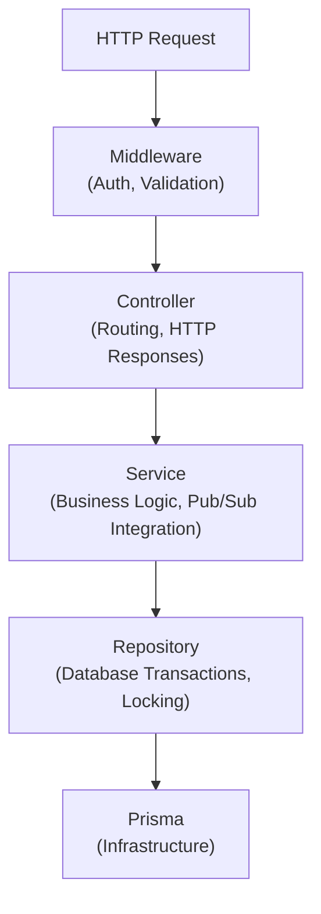

# Backend Architecture

## Overview

The SnapBid backend utilizes a multi-layered architecture within `apps/server` to separate routing, business logic, and data access. It relies on shared packages (`@snapbid/database` and `@snapbid/auction`) for cross-process domain consistency.

## Layer Responsibilities

### 1. Controllers (`apps/server/src/modules/**/*.controller.ts`)

- The entry point for HTTP requests.
- Responsible for extracting data from the request (params, body, headers).
- Passes normalized data to Services.
- Handles HTTP responses and formatting.
- Contains **no business logic** and **no direct database queries**.

### 2. Services (`apps/server/src/modules/**/*.service.ts`)

- The core location for application-level business logic.
- Orchestrates multiple repositories if needed.
- Handles interactions with infrastructure (e.g., publishing to Redis Pub/Sub after a successful database operation).
- Example: `bid.service.ts` calls `bid.repository.ts` to insert the bid, then publishes a socket event via Redis.

### 3. Repositories (`apps/server/src/modules/**/*.repository.ts` and `@snapbid/auction`)

- The abstraction layer over the Prisma ORM.
- Contains raw database queries, transactions, and locking mechanisms.
- Ensures data integrity (e.g., the `SELECT ... FOR UPDATE` transaction in `bid.repository.ts`).
- Returns clean domain objects to the Services.

### 4. Middleware (`apps/server/src/middlewares/`)

- Infrastructure-level request interception.
- **Validation**: Uses Zod schemas (from `@snapbid/shared`) to validate request bodies/params.
- **Authentication**: Verifies JWT access tokens and attaches the user payload to `req.user`.
- **Error Handling**: Catches domain exceptions (`AppError`, `AuctionError`) and translates them into consistent HTTP error responses.

## Shared Packages

### Database Package (`packages/database`)

Provides the initialized Prisma client. Centralizing the database client here ensures that `apps/server`, `apps/worker`, and `@snapbid/auction` all use the exact same generated types and connection configurations, avoiding version drift.

### Auction Package (`packages/auction`)

Because the auction lifecycle (starting, ending) must be executed by the background `worker`, the core domain logic for these transitions is isolated in `@snapbid/auction`.

- It contains its own `services/auction-lifecycle.service.ts` and `repositories/auction-lifecycle.repository.ts`.
- This allows the worker to safely transition state without importing Express-specific code from `apps/server`.

## Dependency Direction

`
