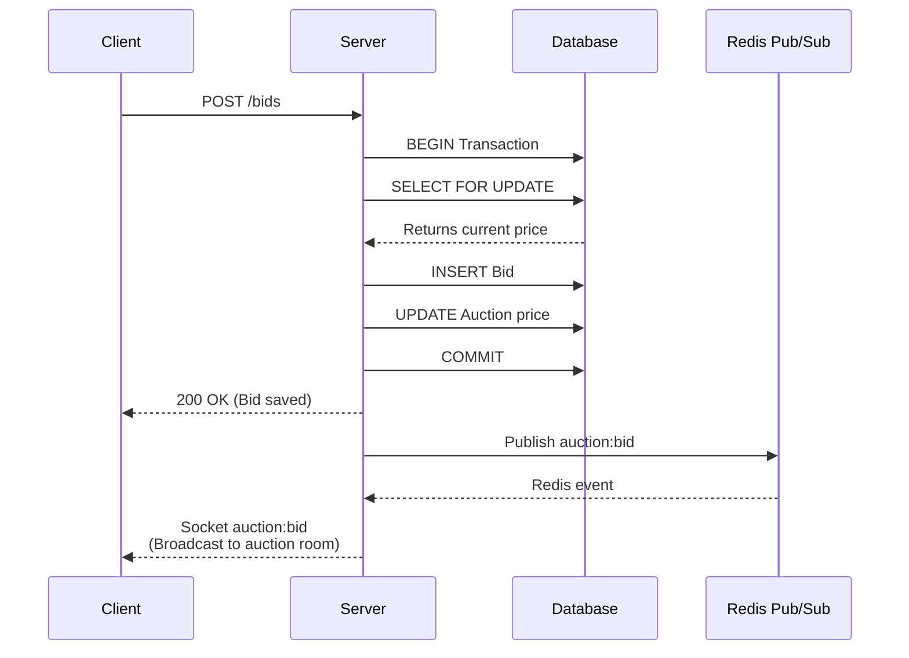

# Bidding System

## Architecture Principle

```text
REST API = Command Path
Socket.IO = Notification Path
PostgreSQL = Source of Truth
```

In SnapBid, **clients cannot place bids through Socket.IO**.

Bidding is a high-stakes, transactional operation. Using standard HTTP REST endpoints ensures reliable request/response cycles, proper HTTP status codes for errors (e.g., 409 Conflict, 400 Bad Request), and integrates cleanly with Express middleware for validation and authentication. Socket.IO is strictly reserved for outbound notifications to clients.

## Bidding Flow

### 1. HTTP Request

The client sends a `POST /api/auctions/{auctionId}/bids` request containing the `auctionId` and `amount`.

### 2. Validation & Concurrency Control

The request is processed by `bid.repository.ts`, which initiates a PostgreSQL database transaction (`prisma.$transaction`).

To prevent race conditions, the repository locks the specific auction row:

```sql
SELECT ... FROM "Auction" WHERE "id" = $1 FOR UPDATE
```

This forces any concurrent bid requests for the same auction to wait until the current transaction completes. (See [concurrency.md](concurrency.md) for deeper details).

### 3. Rule Enforcement

Inside the locked transaction, the system enforces business rules:

- **State Validation**: The auction `status` must be `LIVE`.
- **Time Validation**: The current time must be between `startTime` and `endTime`.
- **Seller Restriction**: The `sellerId` cannot match the `bidderId` (sellers cannot bid on their own auctions).
- **Minimum Bid Rule**: The submitted `amount` must be `>= currentPrice + bidIncrement`.

### 4. Database Mutations

If all rules pass, the transaction performs two operations:

1. Creates a new `Bid` record.
2. Updates the `Auction` record, setting `currentPrice` to the new bid amount.

The transaction is then committed.

### 5. Realtime Notification

After the transaction successfully commits, `bid.service.ts` publishes an internal event to Redis Pub/Sub:

```json
{
  "event": "auction:bid",
  "payload": {
    "auctionId": "...",
    "bid": { ... },
    "currentPrice": "..."
  }
}
```

The Server, listening to Redis Pub/Sub, receives this event and broadcasts it over Socket.IO to all users currently in the `auction:<id>` room.

## The Response/Event Relationship


