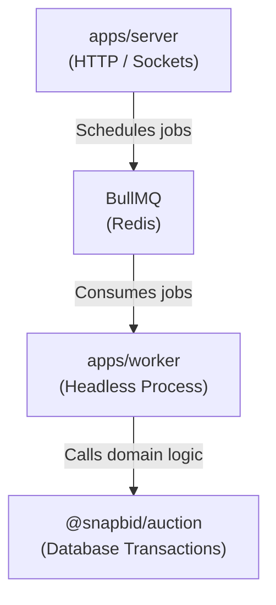

# BullMQ Worker Architecture

## Overview

SnapBid utilizes **BullMQ** to handle scheduled background tasks. Specifically, the lifecycle of an auction (when it starts and ends) is time-dependent. Instead of running continuous `setInterval` polling loops in the API server, SnapBid schedules precise, delayed jobs.

## The Worker Process (`apps/worker`)

The worker is a standalone Node.js application.

### Why a separate worker?

1. **Performance**: Processing jobs (like finalizing an auction and calculating winners) can be computationally and database intensive. Offloading this to a separate process ensures the HTTP/Socket server remains responsive.
2. **Scalability**: Workers can be scaled independently of the API server.
3. **Resilience**: If the worker crashes, the API server is unaffected. BullMQ will simply hold the jobs in Redis until the worker restarts.

## Job Architecture

### The `auction` Queue

All auction lifecycle events are placed into a single BullMQ queue named `auction`.

### Job Types

The worker (`auction.worker.ts`) listens to the `auction` queue and switches logic based on the `job.name`:

#### 1. `START_AUCTION`

- **Payload**: `{ auctionId: string }`
- **Execution**: Calls `startAuctionService` from the `@snapbid/auction` package.
- **Side Effect**: If successfully started, publishes an `auction:started` event via Redis Pub/Sub.

#### 2. `END_AUCTION`

- **Payload**: `{ auctionId: string }`
- **Execution**: Calls `endAuctionService` from the `@snapbid/auction` package.
- **Side Effect**: If successfully ended, determines the winner and publishes an `auction:ended` event via Redis Pub/Sub.

## Architecture Boundaries

The worker **must not** import `apps/server` code, and specifically, it must not import the Socket.IO server initialization.

By adhering to this boundary, the worker remains a pure background process that interacts with the outside world solely through PostgreSQL state changes and Redis Pub/Sub messages.
