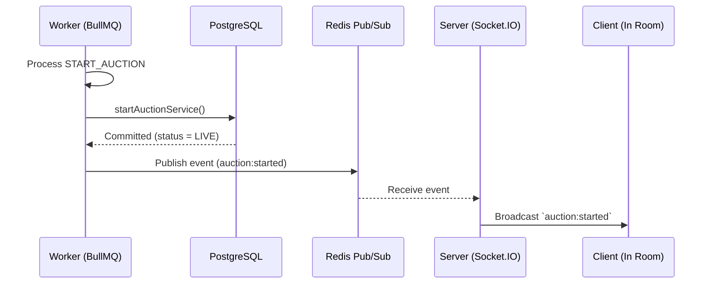
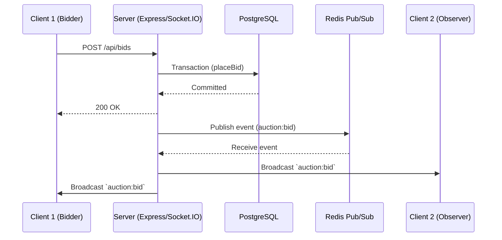
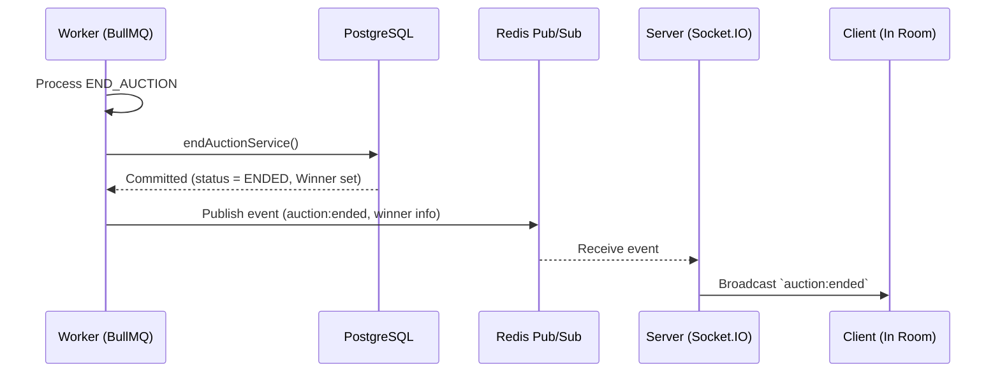

# Realtime Architecture

## Overview

SnapBid requires real-time capabilities to provide instant feedback to users when auctions start, receive bids, and end.

The realtime architecture relies on **Socket.IO** for client connections and **Redis Pub/Sub** for cross-process communication between the Worker and the Server.

## Why Redis Pub/Sub?

The auction lifecycle jobs (`START_AUCTION`, `END_AUCTION`) run in a dedicated `apps/worker` process. Because this process is entirely separate from the Express HTTP server (`apps/server`), the Worker does not have access to the active Socket.IO server or connected clients.

To solve this, SnapBid uses a generic Pub/Sub pattern:

1. The **Worker** executes a database state change.
2. The **Worker** publishes an event to a shared Redis Pub/Sub channel.
3. The **Server**, which holds the active Socket.IO connections, listens to the Redis channel.
4. When the **Server** receives an event from Redis, it translates it into a Socket.IO broadcast to the appropriate room.

> **Note**: This is distinct from the Socket.IO Redis Adapter. Currently, SnapBid uses Redis Pub/Sub manually to bridge the Worker and the Server.

## Sequence Diagrams

### 1. Auction Starts (Worker-driven)

Triggered when the auction `startTime` is reached.

### 2. Bid Placed (Server-driven)

Triggered when a user places a bid via the REST API.

### 3. Auction Ends (Worker-driven)

Triggered when the auction `endTime` is reached.

## Socket.IO as a Notification Layer

In SnapBid, Socket.IO is strictly a notification layer. It is not the source of truth.

- **Initial State**: Clients should not rely on Socket.IO to receive the initial state of an auction. When a client opens an auction page, it must fetch the current state and bid history via the REST API.
- **Reconnection**: If a client disconnects and reconnects, they may miss Socket.IO events. They should always re-fetch the current auction state from the REST API upon reconnection.
- **Ephemeral State**: Room membership is ephemeral and maintained only in memory by the Socket.IO server. It is not persisted to PostgreSQL.
