# System Overview

## Problem Context

SnapBid provides a real-time auction platform where users can schedule items for bidding. The core challenge in live auctions is maintaining strict data integrity (preventing bid races where two users bid the same amount simultaneously) while simultaneously providing instant, real-time feedback to all participants in an auction.

## Main Actors

- **Seller**: An authenticated user who creates and schedules an auction. They define the starting price, bid increment, and timeframe.
- **Bidder**: An authenticated user attempting to place bids on live auctions.
- **Authenticated User**: Any registered user (identified via JWT). They can browse auctions, join rooms, and act as either a seller or bidder.

## Domain Entities

- **Auction**: The core entity representing an item for sale. It contains price configuration, scheduling information, and lifecycle status.
- **Bid**: An immutable record of a user's financial commitment at a specific point in time.

## High-Level System Flow

The complete flow of an auction from creation to completion is handled across REST APIs, background jobs, and real-time sockets:

```mermaid
flowchart TD
    A[User] --> B[Authentication<br/>REST API → JWT]

    B --> C[Browse Scheduled Auctions<br/>REST API]

    C --> D[Open Auction Page]

    D --> E[Join Realtime Auction Room<br/>Socket.IO: auction:join]

    E --> F[START_AUCTION Job<br/>BullMQ Worker]

    F --> G[Auction becomes LIVE<br/>PostgreSQL]

    G --> H[Worker publishes auction state<br/>Redis Pub/Sub]

    H --> I[Server receives Redis event]

    I --> J[Server emits auction:started<br/>Socket.IO]

    J --> K[Users submit bids<br/>POST /bids]

    K --> L[Concurrent Bid Validation<br/>PostgreSQL Row Lock]

    L --> M[Create Bid + Update Current Price<br/>PostgreSQL Transaction]

    M --> N[Transaction Commit]

    N --> O[Publish auction:bid<br/>Redis Pub/Sub]

    O --> P[Server broadcasts auction:bid<br/>Socket.IO Auction Room]

    P --> Q[END_AUCTION Job<br/>BullMQ Worker]

    Q --> R[Auction ends + Winner determined<br/>PostgreSQL]

    R --> S[Worker publishes auction state<br/>Redis Pub/Sub]

    S --> T[Server emits auction:ended<br/>Socket.IO]

    T --> U[Users receive final auction result]
```

